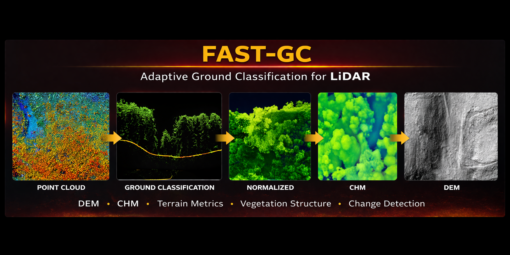
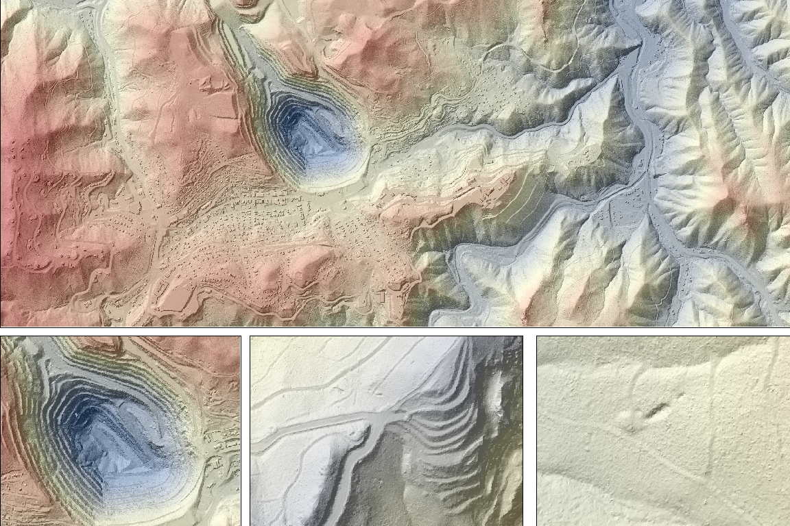
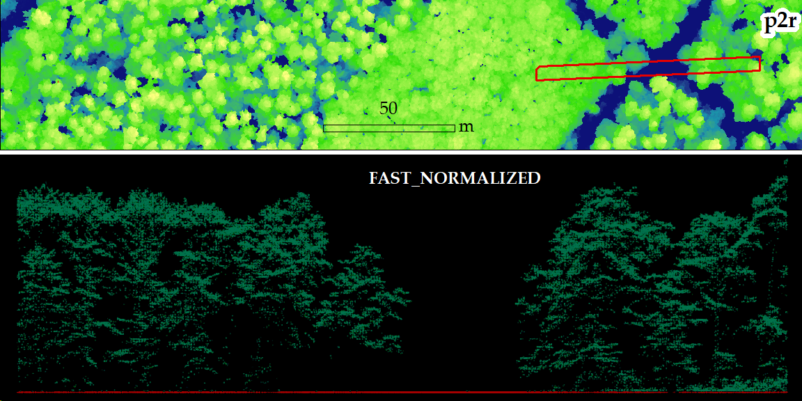
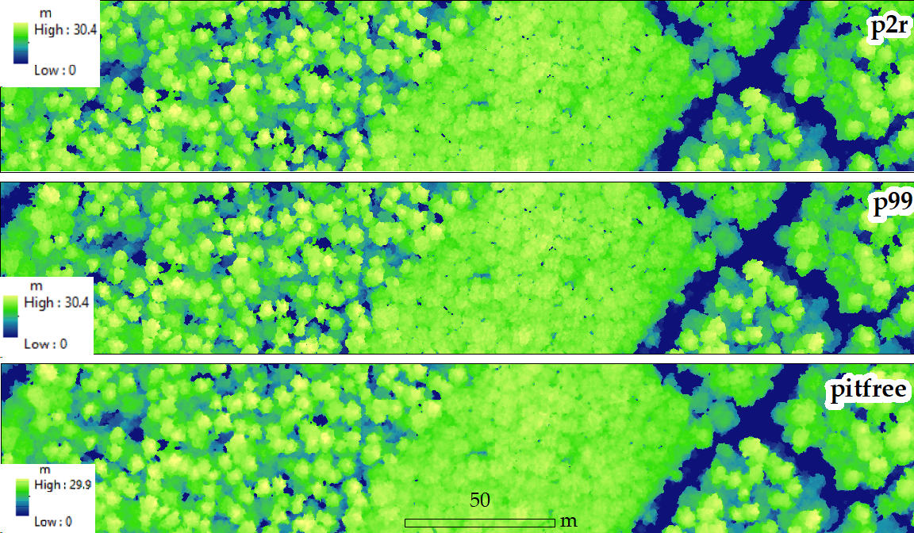
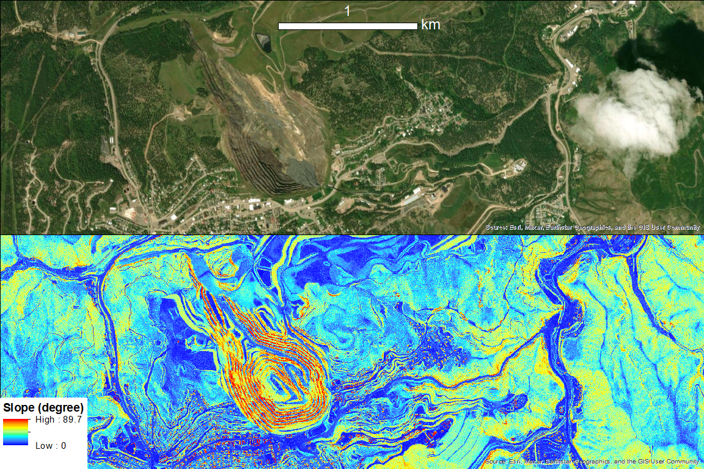

# FAST-GC

<p align="center">
  
</p>

## Fully Adaptive Self-Tuning Sensor-Agnostic LiDAR Ground Classification Framework


[](https://opentopography.org)

FAST-GC (Fully Adaptive Self-Tuning Sensor-Agnostic Ground Classification) is a Python framework for LiDAR ground classification and downstream terrain and canopy workflows across multiple sensor platforms.

It currently supports:

- ground classification
- DEM generation
- DSM generation
- normalized point cloud generation
- CHM generation
- terrain derivatives
- ITD workflows
- raster change workflows
- automatic tiling and tile merging for large datasets

## Supported sensor modes

- `ALS` — Airborne Laser Scanning
- `ULS` — UAV Laser Scanning
- `TLS` — Terrestrial Laser Scanning

## Installation

### Install from PyPI

```bash
pip install fastgc

### Install from source
git clone https://github.com/nadeemfareed/FAST-GC.git
cd FAST-GC
pip install -e .

### Conda environment
conda env create -f environment.yml
conda activate fastgc
pip install -e .
## Google Colab Quick Start


FAST-GC can also be run directly in Google Colab for small to medium LAS/LAZ files stored in Google Drive.

### 1. Install FAST-GC

```python
!pip install fastgc
### 2. mount drive
from google.colab import drive
drive.mount('/content/drive')
### Example run
!fastgc \
  --in_path "/content/drive/MyDrive/ABC.las" \
  --out_dir "/content/drive/MyDrive/ALS_fastgc_output" \
  --sensor_mode ALS \
  --workflow tile-run-merge \
  --tile_size_m 250 \
  --buffer_m 5 \
  --products FAST_GC FAST_DEM FAST_NORMALIZED FAST_DSM FAST_CHM FAST_TERRAIN \
  --grid_res 0.5 \
  --dem_method nearest \
  --dsm_method nearest \
  --chm_method pitfree \
  --jobs 2 \
  --joblib_backend loky \
  --overwrite
### Run on you local machine
fastgc \
  --in_path "F:\lidar_data\USA" \
  --out_dir "F:\FAST_GC_Test" \
  --sensor_mode ALS \
  --workflow tile-run-merge \
  --products FAST_GC FAST_DEM FAST_NORMALIZED FAST_DSM FAST_CHM FAST_TERRAIN \
  --grid_res 0.25 \
  --dem_method nearest \
  --dsm_method max \
  --chm_methods pitfree \
  --terrain_products all \
  --apply_fp_fix \
  --jobs 8 \
  --joblib_backend loky \
  --overwrite \
  --overwrite_tiles
  
# FAST-GC (Fully Adaptive Self-Tuning Sensor-Agnostic Ground
Classification) is a robust LiDAR processing framework designed for
**automated ground classification and terrain modeling** across multiple
LiDAR acquisition systems. The algorithm is designed from user experience perspective.
100% Python: can be run on multiple operating systems using command-line

The algorithm is designed to be:

-   **Parameter-free**
-   **Sensor-agnostic**
-   **Computationally scalable - therefore most effficent tiling workflow is implimented**
-   **Suitable for large LiDAR datasets - input Terabites (TB) of pointclouds (LAS/LAZ)**
-   **For faster processing and efficent use of compututional resources - supported by joblib_backend**

FAST-GC automatically adapts its processing pipeline according to sensor
modality and point cloud characteristics, enabling consistent ground
classification across diverse environments and survey configurations.

FAST-GC currently supports:

-   ground classification
-   digital elevation model/digital terrain model (DEM/DTM) generation
-   digital surface model generation -spikefree 
-   canopy height model generation - multiple variants
-   DEM-normalized LiDAR point clouds
-   terrain derivative generation: slope, aspect, curvalture, hillshade,
-   individual tree detection (**ITD**) - CHM based approaches 
-   change-analysis: change detection in multiple rasters
-   automatic tiling and tile merging for large datasets

------------------------------------------------------------------------

# Article Title

## FAST-GC: Fully Adaptive Self-Tuning Sensor-Platform Agnostic Ground Classification Algorithm for Terrestrial Ecosystem

**Authors**\
Nadeem Fareed et al.

**Manuscript status**\
Manuscript documenting the FAST-GC will be available soon - check for the updates

------------------------------------------------------------------------

# Supported LiDAR Sensors

FAST-GC supports multiple LiDAR acquisition systems.

  Sensor   Description
  -------- ----------------------------
  ALS      Airborne Laser Scanning
  ULS      UAV Laser Scanning
  TLS      Terrestrial Laser Scanning

The algorithm automatically adapts to sensor geometry, point density,
and acquisition characteristics.

------------------------------------------------------------------------

# Why FAST-GC?

Ground classification is one of the most critical preprocessing steps in
LiDAR analysis because it directly affects the quality of downstream
terrain and canopy products e.g., CHMs, DEM, 

FAST-GC is designed to provide a unified workflow for:

-   robust ground / non-ground separation
-   scalable processing of large LiDAR datasets
-   cross-sensor support for ALS, ULS, and TLS data
-   terrain derivative generation from classified outputs
-   canopy and tree-analysis workflows from normalized LiDAR and CHMs

Unlike many traditional workflows that require significant manual
parameter tuning, FAST-GC is designed to operate in a **self-tuning and
sensor-adaptive** manner.

------------------------------------------------------------------------

# Key Features

-   Sensor-agnostic ground classification
-   Parameter-free processing pipeline
-   Automatic tiling for massive datasets
-   Batch processing support
-   Tile merging for seamless final outputs
-   Terrain derivative generation
-   CHM generation using multiple algorithms
-   DEM-normalized point-cloud generation
-   Support for large wall-to-wall LiDAR processing
-   Compatible with local, Conda, Colab, and cloud-based workflows

# FAST-GC Processing Workflow

``` text
Input LiDAR
↓
Automatic Tiling (optional yet useful for wide area mapping )
↓
Ground Classification
↓
FP-Fix Correction
↓
Final Ground Points
↓
DEM Generation
↓
DSM Generation (Can be directly processed on raw point clouds - ground classification is not required for DSM)
↓
Point Cloud Normalization
↓
CHM Generation
↓
Terrain Derivatives
↓
ITD / Change workflows (optional)
↓
Merge Tiles
```

------------------------------------------------------------------------

# Example Outputs

The following placeholders assume all figures are stored in:

``` text
docs/images/
```

# Example Outputs

## Ground Classification


## DEM


## Normalized Point Cloud


## CHM


## Terrain Products

### Slope


### TWI


---

# Ground Classification Comparison

## Original Point Cloud


## FAST-GC Classified Point Cloud


**Color legend:**
- Red → Ground points  
- Green → Objects above the terrain (OT): trees, shrubs, buildings
                                                                   powerlines, electric poles

------------------------------------------------------------------------
------------------------------------------------------------------------

# Cloud and Notebook Support

FAST-GC is suitable for:

-   local workstation processing
-   Conda-based environments
-   Google Colab notebooks
-   cloud deployment workflows
-   large geospatial data-processing pipelines

------------------------------------------------------------------------

# Command-Line Interface

FAST-GC provides a command-line interface through the `fastgc` command.

Basic syntax:

``` bash
fastgc --in_path <input> --sensor_mode <ALS|ULS|TLS>
```

Typical arguments include:

  Parameter         Description
  ----------------- ------------------------------
  `--in_path`       Input LAS/LAZ file or folder
  `--out_dir`       Output directory
  `--sensor_mode`   ALS / ULS / TLS
  `--workflow`      Processing workflow
  `--products`      Requested output products
  `--grid_res`      Raster resolution
  `--tile_size_m`   Tile size in meters
  `--buffer_m`      Tile buffer size
  `--jobs`          Number of CPU workers
  `--recursive`     Recursively scan folders
  `--no_fp_fix`     Disable FP-Fix

------------------------------------------------------------------------

# FAST-GC Workflows

  -----------------------------------------------------------------------
  Workflow                       Description
  ------------------------------ ----------------------------------------
  `tile-only`                    Tile large LiDAR files without
                                 processing

  `run`                          Run processing on existing tiles

  `tile-run`                     Tile and process in one workflow

  `derive-only`                  Derive missing products from existing
                                 processed outputs e.g, from FAST_GC tiles with ground points - CHMs can be generated

  `merge`                        Merge tile outputs into mosaics - combine all tiles into a single raster

  `tile-run-merge`               Full end-to-end tiled workflow 
  -----------------------------------------------------------------------

------------------------------------------------------------------------

# Pre-Processing (Tiling Large LiDAR Files)

Large LiDAR datasets should be tiled for efficient processing.

## Important Parameters

  -----------------------------------------------------------------------
  Parameter                        Description
  -------------------------------- --------------------------------------
  `tile_size_m`                    Size of processing tiles (meters)

  `buffer_m`                       Overlap between tiles (meters) - to fix if any tile boundary artefacts

  `sensor_mode`                    ALS / ULS / TLS - User must know which sensor was used.

  `small_tile_merge_frac`          Merge very small planned tiles into
                                   neighbors: when a planned tile is too small for processing

  `overwrite_tiles`                Force tile rebuild - to overwrite the existing tiles in the output dir.
  -----------------------------------------------------------------------
## Example: set working directory or repo paths
## if not installed through pip or conda
cd "C:\folder\FAST-GC" 

## Example 1 --- Tiling Only

``` bash
fastgc \
  --in_path "F:\lidar_data\USA" \
  --out_dir "F:\lidar_data" \
  --sensor_mode ALS \
  --workflow tile-only \
  --tile_size_m 100 \
  --buffer_m 5 \
  --recursive
```

Output structure:

``` text
ALS_tiles/
   tiles/
   tile_manifest.json
```

------------------------------------------------------------------------

# Ground Classification

FAST-GC performs multi-stage ground classification.

## Steps

1.  Initial ground detection\
2.  DEM construction\

## Run FAST-GC on a Single File

``` bash
fastgc \
  --in_path input.las \
  --sensor_mode ALS \
  --products FAST_GC
```

## Batch Processing (Tiled Dataset) - Example 1

``` bash
fastgc \
  --in_path "F:\lidar_data\USA" \
  --out_dir "F:\lidar_data" \
  --sensor_mode ALS \
  --workflow run \
  --products FAST_GC \
  --recursive
```
------------------------------------------------------------------------

# Terrain Derivative Products

FAST-GC can generate terrain products directly from the DEM.

## Primary raster products

  Product             Description
  ------------------- ----------------------------
  `FAST_DEM`          Digital Elevation Model
  `FAST_DSM`          Digital Surface Model
  `FAST_CHM`          Canopy Height Model
  `FAST_NORMALIZED`   DEM-normalized point cloud
  `FAST_TERRAIN`      Terrain derivatives
   `FAST_STRUCTURE`      Forest canopy derivatives
   `FAST_ITD`      Individual trees detection using CHM/DSM
    `FAST_Pointclouds`      segmenting pointclouds to individual trees 
	                                    using crown.shp or FAST_ITD
    `FAST_CHANGE`      Algorithms to find the change between mulitple raster
	                                e.g., CHMs, DSMs, DEM (temporal change analysis)

## Terrain product abbreviations

  ----------------------------------------------------------------------------------
  Abbreviation                Product                      Description
  --------------------------- ---------------------------- -------------------------
  `SLP_PCT`                   slope_percent                Slope expressed as
                                                           percent rise

  `SLP_DEG`                   slope_degrees                Slope expressed in
                                                           degrees

  `ASP`                       aspect                       Direction of steepest
                                                           downhill slope

  `HLSHD`                     hillshade                    Simulated illumination
                                                           from a light source

  `CURV`                      curvature                    General surface curvature

  `TPI`                       topographic_position_index   Relative elevation
                                                           compared to neighboring
                                                           cells

  `TWI`                       topographic_wetness_index    Relative wetness / flow
                                                           accumulation indicator

  `TCI`                       terrain_convergence_index    Relative terrain-flow
                                                           convergence index
  ----------------------------------------------------------------------------------

Outputs are provided in:

-   LAS / LAZ format
-   GeoTIFF raster format

------------------------------------------------------------------------

# Raster Creation Methods

## DEM Methods

  Method      Description
  ----------- ----------------------------
  `min`       Minimum Z value
  `max`       Maximum Z value
  `mean`      Average elevation
  `nearest`   Nearest point assignment
  `idw`       Inverse Distance Weighting

Default:

``` text
--dem_method min
```

## DSM Methods

  Method      Description
  ----------- ----------------------------
  `min`       Minimum Z value
  `max`       Maximum Z value
  `mean`      Average elevation
  `nearest`   Nearest point assignment
  `idw`       Inverse Distance Weighting

Default:

``` text
--dsm_method max
```

------------------------------------------------------------------------

# CHM Algorithms

FAST-GC supports multiple CHM algorithms.

  -----------------------------------------------------------------------
  Method                      Description
  --------------------------- -------------------------------------------
  `p2r`                       Point-to-raster canopy surface
                                 (transform highest points in the grid to create CHM)
  `p99`                       99th percentile canopy surface
                                (use only the 99th percentile to create CHM)

  `tin`                       Triangulated canopy surface

  `pitfree`                   Pit-free canopy model (Khosravipour et al., 2014)

  `spikefree`                 Spike-filtered canopy model

  `percentile`                Selector-based CHM workflow (Fareed et al., 2026)

  `percentile_top`            Selector-based CHM workflow using upper (Fareed et al., 2026)
                              canopy heights

  `percentile_band`           Selector-based CHM workflow using a
                              selected canopy-height band (Fareed et al., 2026)
  -----------------------------------------------------------------------

### CHM selectors

Selector-based CHM workflows operate on **FAST_NORMALIZED** point clouds
first, then apply the selected CHM surface method.

Examples: - `percentile_top` with `p2r` - `percentile_top` with `p99` -
`percentile_band` with `p2r`

### Optional CHM smoothing

FAST-GC provides optional CHM smoothing.

  Parameter              Description
  ---------------------- ---------------------------------
  `chm_smooth_method`    `none`, `median`, or `gaussian`
  `chm_median_size`      Median filter window size
  `chm_gaussian_sigma`   Gaussian smoothing sigma
  `chm_min_height`       Minimum canopy-height threshold

Example:

``` bash
--chm_smooth_method median \
--chm_median_size 3 \
--chm_min_height 0.25
```

------------------------------------------------------------------------

# ITD and Change Workflows

FAST-GC includes workflow scaffolds for:

-   **FAST_ITD** --- Individual Tree Detection
-   **FAST_CHANGE** --- Change detection

These are integrated into the product and workflow structure so they can
be extended consistently as algorithm modules mature.

------------------------------------------------------------------------

# Example --- Generate All Products
'''
fastgc `
  --in_path $IN `
  --out_dir $ROOT `
  --sensor_mode ALS `
  --workflow tile-run-merge `
  --tile_size_m 250 `
  --buffer_m 5 `
  --products all `
  --grid_res 0.25 `
  --dem_method nearest `
  --dsm_method max `
  --chm_methods p2r p99 pitfree `
  --terrain_products all `
  --apply_fp_fix `
  --jobs 8 `
  --joblib_backend loky `
  --overwrite `
  --overwrite_tiles
```

# Example --- Generate Selected Products

### Tile, classify, and derive products, but do not merge

``` bash
ffastgc `
  --in_path $IN `
  --out_dir $ROOT `
  --sensor_mode ALS `
  --workflow tile-run `
  --tile_size_m 250 `
  --buffer_m 5 `
  --products FAST_GC FAST_DEM FAST_NORMALIZED FAST_DSM FAST_CHM FAST_TERRAIN `
  --grid_res 0.25 `
  --dem_method nearest `
  --dsm_method max `
  --chm_methods p2r p99 pitfree `
  --terrain_products all `
  --apply_fp_fix `
  --jobs 8 `
  --joblib_backend loky `
  --overwrite `
  --overwrite_tiles
```

### Merge all non-CHM tiled outputs

``` 
fastgc `
  --in_path $WS `
  --sensor_mode ALS `
  --workflow merge `
  --products FAST_GC FAST_DEM FAST_NORMALIZED FAST_DSM FAST_TERRAIN
```

### Merge one CHM method at a time

``` bash
ffastgc `
  --in_path $WS `
  --sensor_mode ALS `
  --workflow merge `
  --products FAST_CHM `
  --chm_method p2r
```

### Whole-file processing with no tiling
### FAST-GC only
### Choose the sensor mode one of the option (ALS, ULS, TLS)
### MLS/PLS falls under the sensor mode TLS

``` bash
fastgc `
  --in_path $IN `
  --out_dir $ROOT `
  --sensor_mode ALS `
  --workflow run `
  --products FAST_GC `
  --grid_res 0.25 `
  --apply_fp_fix `
  --jobs 8 `
  --joblib_backend loky `
  --overwrite
```

------------------------------------------------------------------------

# Example --- Derive Missing Products from Existing FAST_GC

If `FAST_GC` already exists, FAST-GC can derive downstream products
without re-running ground classification.

## Example --- derive CHM only

``` bash
fastgc \
  --in_path "F:\lidar_data\Utah\ALS_tiles" \
  --sensor_mode ALS \
  --workflow derive-only \
  --products FAST_CHM \
  --grid_res 0.5
```

## Example --- derive DEM, NORMALIZED, and CHM

``` bash
fastgc \
  --in_path "F:\lidar_data\Utah\ALS_tiles" \
  --sensor_mode ALS \
  --workflow derive-only \
  --products FAST_DEM FAST_NORMALIZED FAST_CHM \
  --grid_res 0.5
```

This workflow is especially useful when:

-   FAST_GC has already been completed
-   one or more downstream products need to be rebuilt
-   long reprocessing of classification should be avoided

------------------------------------------------------------------------

# Tile Merge

When processing tiled datasets, tiles can be merged into final outputs.

``` bash
fastgc \
  --in_path "F:\lidar_data\ALS_tiles" \
  --sensor_mode ALS \
  --workflow merge
```

Typical merged outputs:

``` text
Merged_ALS/
FAST_GC.las
FAST_DEM.tif
FAST_DSM.tif
FAST_CHM_*.tif
FAST_NORMALIZED.las
FAST_TERRAIN/
```

------------------------------------------------------------------------

# Complete Example (Single Large LAS/LAZ File)

``` bash
fastgc \
  --in_path "F:\lidar_data\USA\USGS_NRCS_Fugro_201719.laz" \
  --out_dir "F:\FAST_GC_Test\USGS_NRCS_Fugro_201719" \
  --sensor_mode ALS \
  --workflow tile-run \
  --products FAST_GC FAST_DEM FAST_NORMALIZED \
  --tile_size_m 500 \
  --buffer_m 2 \
  --grid_res 0.25 \
  --jobs 10
```

Pipeline executed:

1.  Tile dataset
2.  Ground classification
3.  FP-Fix correction (optional)
4.  DEM generation
5.  DSM generation
6.  Point cloud normalization
7.  CHM generation
8.  Terrain derivatives
9.  ITD / Change workflow inputs
10. Tile merging

------------------------------------------------------------------------

A typical FAST-GC output folder may contain (tiled datasets):

``` text
Processed_ALS/
│
├── FAST_GC/
├── FAST_DEM/
├── FAST_DSM/
├── FAST_CHM/
├── FAST_NORMALIZED/
├── FAST_TERRAIN/
├── FAST_ITD/
└── FAST_CHANGE/
```

For tiled workflows:

``` text
ALS_tiles/
│
├── tiles/
├── tile_manifest.json
├── Processed_ALS/
└── Merged_ALS/
```

------------------------------------------------------------------------

# Citation

If you use FAST-GC in research please cite:

**FAST-GC: Fully Adaptive Self-Tuning Sensor-Platform Agnostic
Ground Classification Algorithm for Terrestrial Ecosystem **

**Authors**\
Nadeem Fareed et al.

------------------------------------------------------------------------

# License

FAST-GC is released under the Apache License 2.0. See the `LICENSE` file
for details.

------------------------------------------------------------------------

# About

FAST-GC is a production grade software framework for scalable LiDAR ground
classification and terrain modeling across ALS, ULS, MLS/PLS, and TLS systems.

It is intended for applications in:

-   terrain modeling
-   forestry
-   vegetation structure analysis
-   wildfire fuel mapping from LiDAR
-   wall-to-wall LiDAR processing
-   large-scale geospatial workflows


------------------------------------------------------------------------

# ADDITIONAL EXECUTION EXAMPLES (EXTENDED WORKFLOWS)

## Example --- FAST_DSM (Tile-wise then Merge)

```bash
fastgc \
  --in_path "F:\FAST_GC_Test\ALS\ALS-on_KA11_2019-07-05_300m_fastgc\ALS_tiles\Processed_ALS" \
  --sensor_mode ALS \
  --workflow derive-only \
  --products FAST_DSM \
  --grid_res 0.25 \
  --dsm_method max \
  --jobs 8 \
  --joblib_backend loky \
  --overwrite
```

```bash
fastgc \
  --in_path "F:\FAST_GC_Test\ALS\ALS-on_KA11_2019-07-05_300m_fastgc\ALS_tiles" \
  --sensor_mode ALS \
  --workflow merge \
  --products FAST_DSM
```

## Example --- FAST_STRUCTURE

```bash
fastgc \
  --in_path "F:\FAST_GC_Test\ALS\ALS-on_KA11_2019-07-05_300m_fastgc\ALS_tiles\Processed_ALS" \
  --sensor_mode ALS \
  --workflow derive-only \
  --products FAST_STRUCTURE \
  --structure_products all \
  --structure_res 0.5 \
  --structure_min_h 2.0 \
  --structure_bin_size 1.0 \
  --canopy_thr 2.0 \
  --structure_na_fill none \
  --jobs 8 \
  --joblib_backend loky \
  --overwrite
```

## Example --- FAST_ITD (Tree Detection and Crowns)

```bash
fastgc \
  --in_path "F:\FAST_GC_Test\ALS\ALS-on_KA11_2019-07-05_300m_fastgc\ALS_tiles\Merged_ALS\ALS-on_KA11_2019-07-05_300m_FAST_CHM_p2r.tif" \
  --sensor_mode ALS \
  --workflow derive-only \
  --products FAST_ITD \
  --itd_method watershed \
  --jobs 8 \
  --joblib_backend loky \
  --overwrite
```

## Example --- FAST_TERRAIN Only

```bash
fastgc \
  --in_path "F:\FAST_GC_Test\ALS\ALS-on_KA11_2019-07-05_300m_fastgc\ALS_tiles\Processed_ALS" \
  --sensor_mode ALS \
  --workflow derive-only \
  --products FAST_TERRAIN \
  --terrain_products all \
  --jobs 8 \
  --joblib_backend loky \
  --overwrite
```

## Example --- FAST_CHANGE

```bash
fastgc \
  --in_path "F:\FAST_GC_Test\ALS\ALS-on_KA11_2019-07-05_300m_fastgc\ALS_tiles\Processed_ALS" \
  --sensor_mode ALS \
  --workflow derive-only \
  --products FAST_CHANGE \
  --change_input_type FAST_CHM \
  --change_mode pairwise \
  --jobs 8 \
  --joblib_backend loky \
  --overwrite
```

------------------------------------------------------------------------
------------------------------------------------------------------------

# Acknowledgements

Funding source during the development of FAST-GC:

The Strategic Environmental Research and Development Program (SERDP) 
and the Environmental Security Technology Certification Program (ESTCP) – FuelsCraft: 
An innovative wildland fuel mapping tool for prescribed fire decision support
 on Department of Defense (DoD) military installations (#RC23-7779)
------------------------------------------------------------------------
