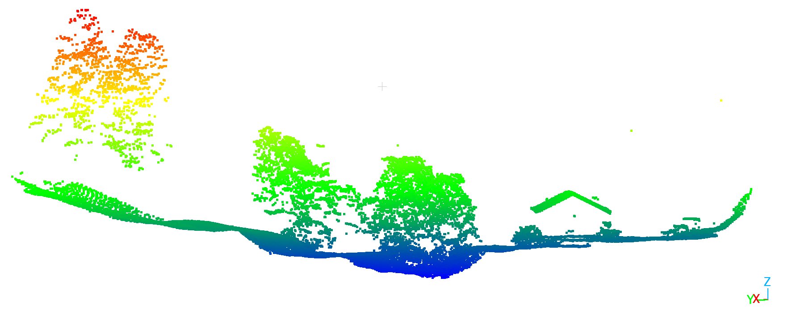
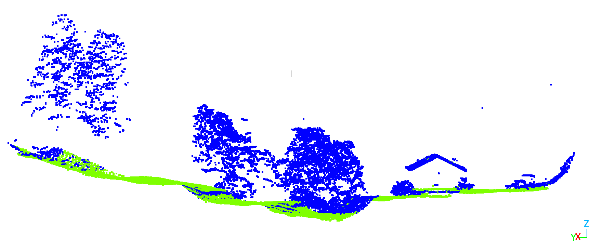

# FAST-GC

## Fully Adaptive Self-Tuning Sensor-Agnostic Ground Classification for LiDAR Point Clouds

FAST-GC (Fully Adaptive Self-Tuning Sensor-Agnostic Ground Classification) is a robust LiDAR processing framework designed for automated ground classification and terrain modeling across multiple LiDAR acquisition systems.

The algorithm is designed to be:

- Parameter-free  
- Sensor-agnostic  
- Computationally scalable  
- Suitable for large LiDAR datasets  

FAST-GC automatically adapts its processing pipeline according to sensor modality and point cloud characteristics, enabling consistent ground classification across diverse environments and survey configurations.

---

# Article Title

## FAST-GC: Fully Adaptive Self-Tuning Sensor-Agnostic Ground Classification Algorithm for LiDAR Point Clouds

**Authors**  
Nadeem Fareed et al.

**Manuscript status**  
Manuscript in preparation.

---

# Supported LiDAR Sensors

FAST-GC supports multiple LiDAR acquisition systems.

| Sensor | Description |
|--------|-------------|
| ALS | Airborne Laser Scanning |
| ULS | UAV Laser Scanning |
| TLS | Terrestrial Laser Scanning |

The algorithm automatically adapts to sensor geometry, point density, and acquisition characteristics.

---

# Key Features

- Sensor-agnostic ground classification  
- Parameter-free processing pipeline  
- Built-in False Positive correction (FP-Fix)  
- Automatic tiling for massive datasets  
- Batch processing support  
- Tile merging for seamless final outputs  
- Terrain derivative generation  

**Outputs include:**

| Output | Description |
|--------|-------------|
| FAST_GC | Classified LiDAR point cloud |
| FAST_DEM | Digital Elevation Model |
| FAST_DSM | Digital Surface Model |
| FAST_CHM | Canopy Height Model |
| FAST_NORMALIZED | DEM-normalized LiDAR point cloud |

---

# FAST-GC Processing Workflow

```text
Input LiDAR
↓
Automatic Tiling (optional)
↓
Ground Classification
↓
FP-Fix Correction
↓
Final Ground Points
↓
DEM / DSM / CHM / Normalized
↓
Merge Tiles
```

---
# Example

| Original LiDAR Point Cloud | FAST-GC Ground Classification |
|---|---|
|  |  |

Color legend:

- Green → Ground points
- Blue → Non-ground points

# Installation

FAST-GC can be installed using **pip** or **conda**.

## Install with pip

```bash
pip install fastgc
```

---

## Install from source

```bash
git clone https://github.com/nadeemfareed/FAST-GC.git
cd FAST-GC
pip install -e .
```

---

## Conda environment (recommended)

```bash
conda create -n fastgc python=3.10
conda activate fastgc
pip install fastgc
```

---

# Pre-Processing (Tiling Large LiDAR Files)

Large LiDAR datasets should be tiled for efficient processing.

## Important Parameters

| Parameter | Description |
|-----------|-------------|
| `tile_size_m` | Size of processing tiles |
| `buffer_m` | Overlap between tiles |
| `sensor_mode` | ALS / TLS / ULS |
| `small_tile_merge_frac` | Merge tiles smaller than threshold |
| `overwrite_tiles` | Force rebuild tiles |

---

## Example — Tiling Only

```bash
fastgc \
  --in_path "F:\lidar_data\USA" \
  --out_dir "F:\lidar_data" \
  --sensor_mode ALS \
  --workflow tile-only \
  --tile_size_m 100 \
  --buffer_m 5 \
  --recursive
```

Output structure:

```text
ALS_tiles/
   tiles/
   tile_manifest.json
```

---

# Ground Classification

FAST-GC performs multi-stage ground classification.

## Steps

1. Initial ground detection  
2. DEM construction  
3. Residual analysis  
4. FP-Fix correction  
5. Final ground classification  

---

## Run FAST-GC on a Single File

```bash
fastgc \
  --in_path input.las \
  --sensor_mode ALS \
  --products FAST_GC
```

---

## Batch Processing (Tiled Dataset)

```bash
fastgc \
  --in_path "F:\lidar_data\ALS_tiles\tiles" \
  --out_dir "F:\lidar_data\ALS_tiles" \
  --sensor_mode ALS \
  --workflow run \
  --products FAST_GC \
  --recursive
```

---

## Disable FP-Fix (optional)

```bash
--no_fp_fix
```

---

# FP-Fix Logic

FP-Fix corrects classification leakage using DEM-normalized elevation.

| Condition | Action |
|-----------|--------|
| Non-ground point with normalized elevation ≤ 0 | Convert to ground |
| Ground point with normalized elevation > 6 cm | Convert to non-ground |

Temporary surfaces used for FP-Fix:

```text
provisional FAST_DEM
provisional FAST_NORMALIZED
```

These are removed automatically unless:

```bash
--keep_fp_fix_temp
```

---

# Terrain Derivative Products

FAST-GC can generate terrain products directly.

| Product | Description |
|---------|-------------|
| FAST_DEM | Digital Elevation Model |
| FAST_DSM | Digital Surface Model |
| FAST_CHM | Canopy Height Model |
| FAST_NORMALIZED | DEM normalized point cloud |

Outputs are provided in:

- **LAS format**
- **GeoTIFF raster format**

---

# Raster Creation Methods

## DEM Methods

| Method | Description |
|--------|-------------|
| `min` | Minimum Z value |
| `mean` | Average |
| `nearest` | Nearest point |
| `idw` | Inverse Distance Weighting |

Default:

```bash
--dem_method min
```

---

## DSM Methods

| Method | Description |
|--------|-------------|
| `max` | Maximum Z value |
| `mean` | Average |
| `nearest` | Nearest point |
| `idw` | Inverse Distance Weighting |

Default:

```bash
--dsm_method max
```

---

# CHM Noise Filtering

Small canopy noise (salt-and-pepper artifacts) may occur due to isolated high points.

FAST-GC provides optional CHM smoothing.

| Parameter | Description |
|-----------|-------------|
| `chm_median_size` | Median filter window |
| `chm_min_height` | Minimum canopy threshold |

Example:

```bash
--chm_median_size 3 \
--chm_min_height 0.25
```

---

# Example — Generate All Products

```bash
fastgc \
  --in_path "F:\lidar_data\ALS_tiles\tiles" \
  --out_dir "F:\lidar_data\ALS_tiles" \
  --sensor_mode ALS \
  --workflow run \
  --products all \
  --grid_res 0.25 \
  --recursive
```

---

# Example — Generate Selected Products

## DEM only

```bash
fastgc --in_path input.las --sensor_mode ALS --products FAST_DEM
```

## DSM only

```bash
fastgc --in_path input.las --sensor_mode ALS --products FAST_DSM
```

## CHM only

```bash
fastgc --in_path input.las --sensor_mode ALS --products FAST_CHM
```

## DEM + DSM

```bash
fastgc --in_path input.las --sensor_mode ALS --products FAST_DEM FAST_DSM
```

---

# Tile Merge

When processing tiled datasets, tiles must be merged into final outputs.

```bash
fastgc \
  --in_path "F:\lidar_data\ALS_tiles" \
  --sensor_mode ALS \
  --workflow merge
```

Final outputs:

```text
Merged_ALS/

FAST_GC.las
FAST_DEM.tif
FAST_DSM.tif
FAST_CHM.tif
FAST_NORMALIZED.las
```

---

# Complete Example (Single Large LAS File)

```bash
fastgc \
  --in_path "F:\lidar_data\Utah_201517.laz" \
  --out_dir "F:\lidar_data" \
  --sensor_mode ALS \
  --workflow tile-run-merge \
  --products all \
  --tile_size_m 250 \
  --buffer_m 5 \
  --grid_res 0.25
```

Pipeline executed:

1. Tile dataset  
2. Ground classification  
3. FP-Fix correction  
4. Point cloud normalization  
5. DEM generation  
6. DSM generation  
7. CHM generation  
8. Tile merging  

---

# Citation

If you use FAST-GC in research please cite:

**FAST-GC: Fully Adaptive Self-Tuning Sensor-Agnostic Ground Classification Algorithm for LiDAR Point Clouds**

**Authors**  
Nadeem Fareed et al.

---

# License

Apache License 2.0. See the [LICENSE](LICENSE) file for details.

---

# Acknowledgements

FAST-GC development builds upon advances in:

- LiDAR terrain analysis  
- Point cloud processing  
- Open-source geospatial computing