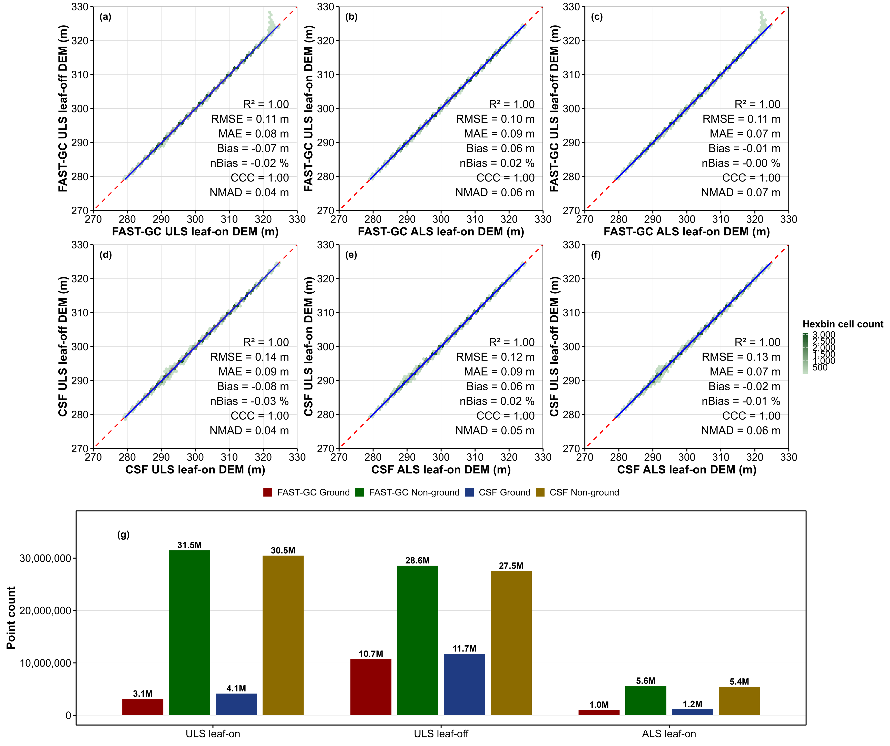

# FAST-GC

```{=html}
<p align="center">
```
``{=html}

```{=html}
</p>
```
## Fully Adaptive Self-Tuning Ground Classification (FAST-GC) 
## parameter-free ground point classifiction

FAST-GC is a Python-first framework for automated LiDAR ground
classification and downstream terrain, surface, canopy,
forest-structure, individual-tree, and raster change-analysis workflows.

The core FAST-GC ground-classification algorithm is designed to adapt to
LiDAR acquisition geometry, point-cloud characteristics, and terrain
conditions while minimizing scene-specific manual tuning. FAST-GC
supports airborne laser scanning (ALS), UAV laser scanning (ULS), and
terrestrial laser scanning (TLS).

FAST-GC 0.2.1 integrates optimized native execution for selected
computational stages. Supported precompiled distributions use this
automatically; normal users do not need to select or configure a
computational backend.

## Scientific Reference

The FAST-GC methodology is documented in the public preprint:

**Fareed, N.; Numata, I.; Silva, C. A.; Prichard, S. J. (2026).**\
**FAST-GC: A Fully Adaptive Self-Tuning Ground Classification Algorithm
for Multi-Platform LiDAR Sensors.**\
Preprints.org, Version 1.

https://www.preprints.org/manuscript/202609.1631

> The manuscript is publicly available as a preprint and has been
> submitted for peer-reviewed publication. The citation will be updated
> when the final peer-reviewed article becomes available.

## Key Capabilities

-   Self-tuning ground classification across ALS, ULS, and TLS point
    clouds
-   LAS/LAZ single-file and batch processing
-   Buffered tiling, parallel processing, and tile merging for large
    datasets
-   Digital elevation and digital surface modeling
-   Height-normalized LiDAR point clouds
-   Multiple canopy-height-model algorithms
-   Terrain derivatives and forest structural metrics
-   Individual-tree detection and tree-level point-cloud extraction
-   Multi-temporal raster change analysis

## Supported LiDAR Platforms

  Sensor mode   Platform
  ------------- ----------------------------
  `ALS`         Airborne Laser Scanning
  `ULS`         UAV / drone Laser Scanning
  `TLS`         Terrestrial Laser Scanning

The acquisition platform is supplied through `--sensor_mode`, allowing
FAST-GC to route the corresponding sensor-specific ground-classification
workflow.

# Installation

FAST-GC 0.2.1 supports Python **3.12-3.14**.

## PyPI --- Recommended

``` bash
pip install fastgc
```

Verify:

``` bash
fastgc --version
fastgc --help
```

Supported precompiled wheels include the optimized execution components
required for normal operation. No separate backend configuration is
required.

## GitHub Source

``` bash
git clone https://github.com/nadeemfareed/FAST-GC.git
cd FAST-GC
pip install .
```

A source build may require a Rust toolchain because selected
computational kernels use native acceleration.

## Conda Development Environment

``` bash
git clone https://github.com/nadeemfareed/FAST-GC.git
cd FAST-GC
conda env create -f environment.yml
conda activate fastgc
pip install -e .
```

See `INSTALLATION.md` for the complete development and environment
policy.

## Google Colab

``` python
!pip install fastgc
```

``` python
from google.colab import drive
drive.mount("/content/drive")
```

``` bash
!fastgc \
  --in_path "/content/drive/MyDrive/input.laz" \
  --out_dir "/content/drive/MyDrive/FASTGC_output" \
  --sensor_mode ALS \
  --products FAST_GC
```

# Quick Start

``` bash
fastgc \
  --in_path input.laz \
  --sensor_mode ALS \
  --products FAST_GC
```

The default product is `FAST_GC`. Input can be a LAS/LAZ file, folder,
or existing processed-product root depending on the workflow.

# FAST-GC Products

FAST-GC provides ten integrated product families. Products can be
requested individually or combined into end-to-end workflows.

## FAST_GC --- Ground Classification

`FAST_GC` is the core product: multi-stage, sensor-adaptive
ground/non-ground classification for ALS, ULS, and TLS point clouds. The
resulting classified terrain points support downstream
terrain-referenced products.

``` bash
fastgc --in_path input.laz --out_dir output --sensor_mode ALS --workflow run --products FAST_GC
```



## FAST_DEM --- Digital Elevation Model

`FAST_DEM` generates a bare-earth terrain raster from classified ground
points. Supported rasterization methods are `min`, `max`, `mean`,
`nearest`, and `idw`; resolution is controlled with `--grid_res`.

``` bash
fastgc \
  --in_path input.laz --out_dir output --sensor_mode ALS \
  --products FAST_GC FAST_DEM --grid_res 0.5 --dem_method nearest
```


## FAST_NORMALIZED --- Height-Normalized Point Cloud

`FAST_NORMALIZED` references point elevations to the local terrain
surface, creating above-ground heights for canopy, structure, and
tree-level analysis.

``` bash
fastgc \
  --in_path input.laz --out_dir output --sensor_mode ALS \
  --products FAST_GC FAST_DEM FAST_NORMALIZED
```


## FAST_DSM --- Digital Surface Model

`FAST_DSM` represents the upper LiDAR surface and can be produced
directly from the point cloud when ground classification is not
otherwise required. Methods are `min`, `max`, `mean`, `nearest`, `idw`,
and `spikefree`.

``` bash
fastgc \
  --in_path input.laz --out_dir output --sensor_mode ALS \
  --products FAST_DSM --grid_res 0.5 --dsm_method max
```


## FAST_CHM --- Canopy Height Models

`FAST_CHM` generates canopy-height surfaces from terrain-referenced
LiDAR. Current methods include:

  Method               Processing concept
  -------------------- ---------------------------------------
  `p2r`                Point-to-raster canopy surface
  `p99`                Percentile-based upper-canopy surface
  `tin`                Triangulated canopy surface
  `pitfree`            Pit-free canopy surface
  `adaptive_pitfree`   Adaptive pit-free processing
  `csf_chm`            Cloth-simulation-based CHM
  `spikefree`          Spike-resistant surface processing
  `percentile`         Percentile selector workflow
  `percentile_top`     Upper-canopy percentile selection
  `percentile_band`    Selected canopy-height-band workflow

Multiple CHMs can be generated in one run:

``` bash
fastgc \
  --in_path input.laz --out_dir output --sensor_mode ALS \
  --products FAST_GC FAST_DEM FAST_NORMALIZED FAST_CHM \
  --chm_methods p2r p99 pitfree
```


## FAST_TERRAIN --- Terrain Derivatives

`FAST_TERRAIN` derives terrain descriptors from the elevation surface:
slope percent, slope degrees, aspect, hillshade, curvature, TPI, TWI,
DTW, and TCI.

``` bash
fastgc \
  --in_path input.laz --out_dir output --sensor_mode ALS \
  --products FAST_GC FAST_DEM FAST_TERRAIN --terrain_products all
```


## FAST_STRUCTURE --- Forest Structure

`FAST_STRUCTURE` derives spatial forest-structure metrics from an
existing `FAST_NORMALIZED` point cloud, including canopy cover, mean
height, maximum height, height standard deviation, foliage height
diversity (FHD), vertical complexity index (VCI), and point count.

``` bash
fastgc \
  --in_path input.laz --out_dir output --sensor_mode ALS \
  --products FAST_GC FAST_DEM FAST_NORMALIZED FAST_STRUCTURE \
  --structure_products all
```


## FAST_ITD --- Individual Tree Detection

`FAST_ITD` provides individual-tree detection workflows using
canopy-height or compatible surface information. Watershed-based and
Yun2021 workflows also support crown delineation; `lmf` provides treetop
detection. The currently implemented public workflows include
local-maxima filtering (`lmf`), watershed (`watershed`), adaptive
watershed (`adaptive_watershed`), and the Yun et al. (2021) workflow
(`yun2021`). The ITD dispatcher is intentionally extensible so
additional tree segmentation methods can be integrated as they are
implemented and validated.

``` bash
fastgc \
  --in_path input.laz --out_dir output --sensor_mode ALS \
  --products FAST_GC FAST_DEM FAST_NORMALIZED FAST_CHM FAST_ITD \
  --chm_method pitfree --itd_method watershed
```


## FAST_TREECLOUDS --- Individual-Tree Point Clouds

`FAST_TREECLOUDS` associates LiDAR points with tree/crown delineations
and creates tree-level point-cloud products. The point source can be
`FAST_NORMALIZED` or `FAST_GC`, with optional individual LAS writing.

``` bash
fastgc \
  --in_path processed_FASTGC_workspace --sensor_mode ALS \
  --workflow derive-only --products FAST_TREECLOUDS \
  --treeclouds_las_source FAST_NORMALIZED --treeclouds_write_individual
```


## FAST_CHANGE --- Raster Change Analysis

`FAST_CHANGE` compares compatible `FAST_DEM`, `FAST_DSM`, `FAST_CHM`, or
`FAST_TERRAIN` raster observations. Comparison modes are `pairwise`,
`sequential`, and `baseline`, with threshold and level-of-detection
controls.

``` bash
fastgc \
  --in_path processed_FASTGC_workspace --sensor_mode ALS \
  --workflow derive-only --products FAST_CHANGE \
  --change_input_type FAST_CHM --change_mode sequential
```


# Processing Architecture

FAST-GC separates raw-LiDAR/core processing from products that depend on
previously derived surfaces or point-cloud products. The core processing
stage comprises `FAST_GC`, `FAST_DEM`, `FAST_NORMALIZED`, `FAST_DSM`,
`FAST_CHM`, and `FAST_TERRAIN`. `FAST_STRUCTURE` is derived from
height-normalized point clouds. `FAST_ITD`, `FAST_TREECLOUDS`, and
`FAST_CHANGE` operate on compatible derived products.

``` text
Input LAS / LAZ
       |
       +----------------------------> FAST_DSM
       |
       v
    FAST_GC
       |
       v
    FAST_DEM ----------------------> FAST_TERRAIN
       |
       v
 FAST_NORMALIZED
       |
       +----------------------------> FAST_CHM
       |                                  |
       |                                  v
       |                              FAST_ITD
       |                                  |
       |                                  v
       |                          FAST_TREECLOUDS
       |
       +----------------------------> FAST_STRUCTURE

Compatible raster observations ------> FAST_CHANGE
```

Not every product requires every preceding stage. For example, DSM
generation can operate directly on a point cloud, whereas
normalized-height products require a terrain reference.

# Workflow Modes

  ---------------------------------------------------------------------
  Workflow                           Purpose
  ---------------------------------- ----------------------------------
  `run`                              Process an input file or
                                     collection directly

  `tile-only`                        Create buffered processing tiles
                                     without deriving products

  `tile-run`                         Tile and process without final
                                     merging

  `tile-run-merge`                   Tile, process, and merge final
                                     outputs

  `merge`                            Merge previously processed tiled
                                     outputs

  `derive-only`                      Derive downstream products from
                                     existing FAST-GC outputs
  ---------------------------------------------------------------------

# Processing Scenarios

## 1. Single LAS/LAZ --- Ground Classification

``` bash
fastgc --in_path input.laz --out_dir output --sensor_mode ALS --workflow run --products FAST_GC
```

Change `ALS` to `ULS` or `TLS` according to the acquisition platform.

## 2. Folder / Batch Processing

``` bash
fastgc \
  --in_path lidar_folder --out_dir output --sensor_mode ULS \
  --workflow run --products FAST_GC --recursive
```

## 3. Large Dataset --- Tiling Only

``` bash
fastgc \
  --in_path large_input.laz --out_dir output --sensor_mode ALS \
  --workflow tile-only --tile_size_m 250 --buffer_m 5
```

## 4. Tile and Process

``` bash
fastgc \
  --in_path large_input.laz --out_dir output --sensor_mode ALS \
  --workflow tile-run --tile_size_m 250 --buffer_m 5 \
  --products FAST_GC FAST_DEM FAST_NORMALIZED
```

## 5. Complete Tile → Process → Merge

``` bash
fastgc \
  --in_path large_input.laz --out_dir output --sensor_mode ALS \
  --workflow tile-run-merge --tile_size_m 100 --buffer_m 5 \
  --products FAST_GC FAST_DEM FAST_NORMALIZED FAST_DSM FAST_CHM FAST_TERRAIN \
  --terrain_products all --jobs 0
```

## 6. Complete Core-Product Workflow

For a large raw LiDAR dataset, the following workflow derives the six
core products in one tiled run and merges the final outputs:

``` bash
fastgc \
  --in_path input.laz --out_dir output --sensor_mode ALS \
  --workflow tile-run-merge --tile_size_m 100 --buffer_m 5 \
  --products FAST_GC FAST_DEM FAST_NORMALIZED FAST_DSM FAST_CHM FAST_TERRAIN \
  --terrain_products all --jobs 0
```

`FAST_STRUCTURE`, `FAST_ITD`, `FAST_TREECLOUDS`, and `FAST_CHANGE` are
specialized or downstream products and should be requested through their
appropriate workflows rather than treating every product as a single
raw-LiDAR processing stage.

## 7. Multiple CHMs in One Run

``` bash
fastgc \
  --in_path input.laz --out_dir output --sensor_mode ALS \
  --products FAST_GC FAST_DEM FAST_NORMALIZED FAST_CHM \
  --chm_methods p2r p99 pitfree adaptive_pitfree
```

## 8. Derive Products Without Re-running Ground Classification

``` bash
fastgc \
  --in_path processed_FASTGC_workspace --sensor_mode ALS \
  --workflow derive-only --products FAST_CHM \
  --chm_methods p2r p99 pitfree
```

Forest structure can similarly be derived from an existing compatible
workspace:

``` bash
fastgc \
  --in_path processed_FASTGC_workspace --sensor_mode ALS \
  --workflow derive-only --products FAST_STRUCTURE \
  --structure_products all
```

## 9. Merge Existing Tiled Results

``` bash
fastgc \
  --in_path processed_FASTGC_workspace --sensor_mode ALS \
  --workflow merge \
  --products FAST_GC FAST_DEM FAST_NORMALIZED FAST_DSM FAST_TERRAIN
```

## 10. Individual-Tree Workflow

``` bash
fastgc \
  --in_path input.laz --out_dir output --sensor_mode ALS \
  --products FAST_GC FAST_DEM FAST_NORMALIZED FAST_CHM FAST_ITD \
  --chm_method pitfree --itd_method watershed
```

## 11. Raster Change Workflow

``` bash
fastgc \
  --in_path processed_FASTGC_workspace --sensor_mode ALS \
  --workflow derive-only --products FAST_CHANGE \
  --change_input_type FAST_CHM --change_mode sequential
```

## 12. Google Colab / Google Drive

``` bash
!fastgc \
  --in_path "/content/drive/MyDrive/input.laz" \
  --out_dir "/content/drive/MyDrive/FASTGC_output" \
  --sensor_mode ALS --workflow run --products FAST_GC
```

Notebook environments are convenient for modest datasets. Large-area
tiled processing is generally better suited to a workstation or
dedicated compute environment.

# Parallel and Large-Area Processing

FAST-GC supports tile-parallel execution. `--jobs 0` allows FAST-GC to
select the available CPU worker count automatically while reserving one
logical CPU.

``` bash
fastgc \
  --in_path large_input.laz --out_dir output --sensor_mode ALS \
  --workflow tile-run-merge --tile_size_m 250 --buffer_m 5 \
  --jobs 0 --products FAST_GC FAST_DEM
```

Explicit worker counts can also be supplied with `--jobs`.

# Typical Output Organization

``` text
FASTGC_output/
|
+-- FAST_GC/
+-- FAST_DEM/
+-- FAST_NORMALIZED/
+-- FAST_DSM/
+-- FAST_CHM/
+-- FAST_TERRAIN/
+-- FAST_STRUCTURE/
+-- FAST_ITD/
+-- FAST_TREECLOUDS/
+-- FAST_CHANGE/
```

Point-cloud products are written as LAS/LAZ outputs and raster products
as geospatial raster outputs according to the selected workflow.

# Figure Placeholders

The README uses standardized product-image locations:

``` text
docs/images/
├── fastgc_banner.png
├── FASTGC.png
├── FASTDEM.png
├── FASTNORMALIZED.png
├── FASTDSM.png
├── FASTCHM.png
├── FASTCHM_PITFREE.png
├── FASTTERRAIN.png
├── FASTSTRUCTURE.png
├── FASTITD.png
├── FASTTREECLOUDS.png
└── FASTCHANGE.png
```

Additional method-specific product figures can be added under
`docs/images/` without changing the workflow documentation.

# Command-Line Reference

The installed CLI is the authoritative reference for current processing
options:

``` bash
fastgc --help
```

Check the installed version with:

``` bash
fastgc --version
```

Advanced options are available for CHM generation, terrain products,
ITD, forest structure, tree-cloud extraction, raster change analysis,
tiling, and parallel processing.

# Validation

The FAST-GC ground-classification methodology has been evaluated across
multi-platform LiDAR observations including ALS, ULS, and TLS data.

Scientific methodology, benchmark design, accuracy assessment,
density-sensitivity analysis, and cross-platform evaluation are
documented in the associated FAST-GC manuscript:

**Fareed, N.; Numata, I.; Silva, C. A.; Prichard, S. J. (2026).**\
*FAST-GC: A Fully Adaptive Self-Tuning Ground Classification Algorithm
for Multi-Platform LiDAR Sensors.*

https://www.preprints.org/manuscript/202609.1631

# Citation

If FAST-GC contributes to your research, please cite:

> Fareed, N.; Numata, I.; Silva, C. A.; Prichard, S. J. (2026).\
> **FAST-GC: A Fully Adaptive Self-Tuning Ground Classification
> Algorithm for Multi-Platform LiDAR Sensors.**\
> Preprints.org, Version 1.\
> https://www.preprints.org/manuscript/202609.1631

The manuscript has been submitted for peer-reviewed publication. Until
the final article is available, the public preprint above is the current
scientific reference. This README will be updated with the final journal
citation and DOI when the peer-reviewed article is published.

# Repository and Support

**Source code:** https://github.com/nadeemfareed/FAST-GC\
**Issues and feature requests:**
https://github.com/nadeemfareed/FAST-GC/issues

# Author and Software Ownership

**Nadeem Fareed**

FAST-GC was conceived, developed, implemented, and is maintained by
**Nadeem Fareed**.

Copyright © 2026 Nadeem Fareed.

# License

FAST-GC is Copyright © 2026 Nadeem Fareed and is licensed under the
**GNU Affero General Public License v3.0 or later (AGPL-3.0-or-later)**.

See `LICENSE` for the complete license terms.
