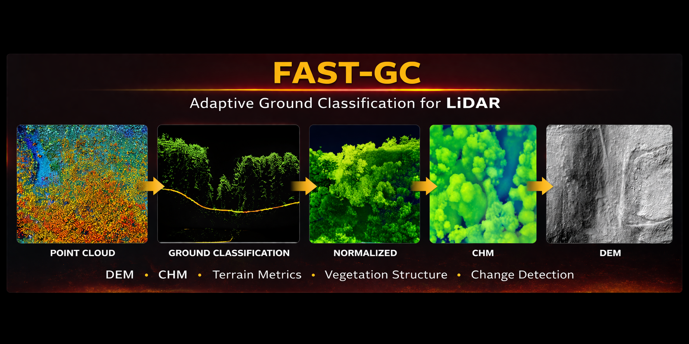
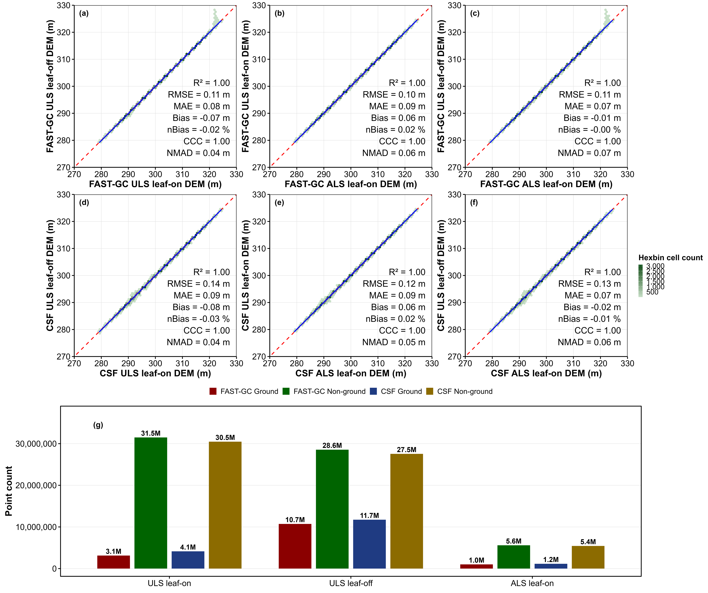
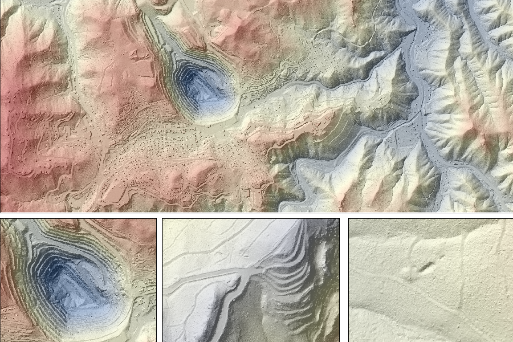
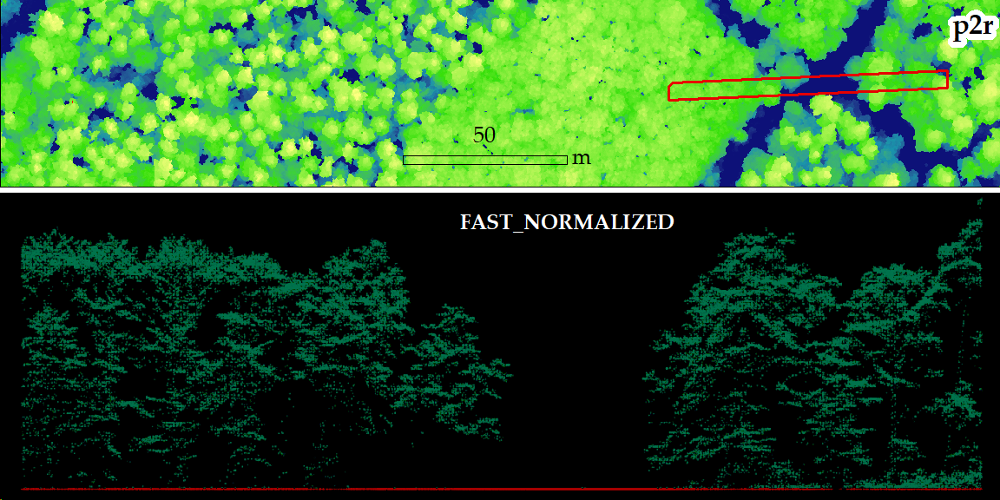
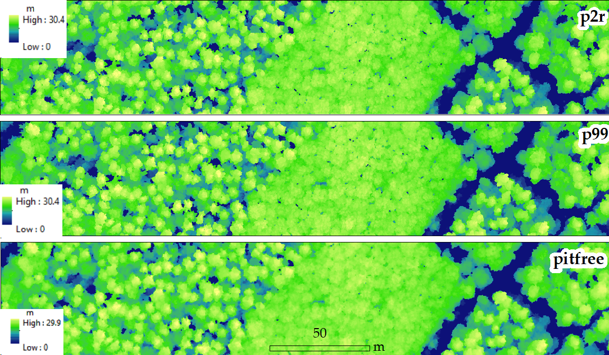
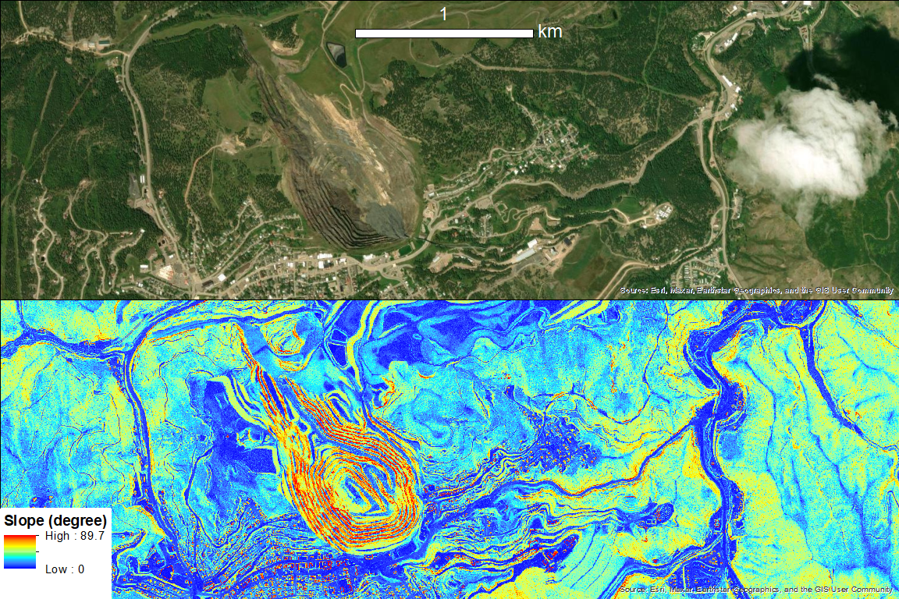

# FAST-GC

<p align="center">
  
</p>

## Fully Adaptive Self-Tuning Ground Classification (FAST-GC)

**Sensor-adaptive ground classification, spatial LiDAR sampling, and
LiDAR-derived geospatial products**

FAST-GC is a Python-first framework for automated LiDAR ground
classification and downstream geospatial analysis. It supports airborne
laser scanning (ALS), UAV laser scanning (ULS), and terrestrial laser
scanning (TLS), and integrates ground classification with digital
terrain and surface modeling, height normalization, canopy modeling,
terrain geomorphometry, continuous-domain hydrology, forest structure,
individual-tree workflows, raster change analysis, and FAST-GIS plot
sampling and clipping.

The core FAST-GC classifier adapts to acquisition geometry, point-cloud
characteristics, and terrain conditions while minimizing scene-specific
manual tuning. FAST-GC 0.2.1 also integrates optimized native execution
for selected computational stages. Supported precompiled distributions
use this automatically; normal users do not need to select or configure
a computational backend.

## Scientific Reference

The FAST-GC ground-classification methodology is documented in the
public preprint:

**Fareed, N.; Numata, I.; Silva, C. A.; Prichard, S. J. (2026).**\
**FAST-GC: A Fully Adaptive Self-Tuning Ground Classification Algorithm
for Multi-Platform LiDAR Sensors.**\
Preprints.org, Version 1.

https://www.preprints.org/manuscript/202609.1631

> The manuscript is publicly available as a preprint and has been
> submitted for peer-reviewed publication. The citation will be updated
> when the final peer-reviewed article becomes available.

## Key Capabilities

-   Self-tuning ground classification across ALS, ULS, and TLS point
    clouds
-   LAS/LAZ single-file, folder, plot-collection, and large-area tiled
    processing
-   Buffered tiling, parallel processing, seam-aware merging, and
    downstream derivation
-   FAST-GIS spatial sampling, plot import, clipping, buffering, and
    managed plot collections
-   Digital elevation models (DEM) and digital surface models (DSM)
-   Height-normalized LiDAR point clouds
-   Multiple canopy-height-model (CHM) algorithms
-   Terrain morphology, curvature, ruggedness, relief, and multiscale
    topographic metrics
-   Continuous-domain D8/MFD hydrology, contributing area, flow length,
    streams, watersheds, and terrain-hydrology indices
-   Raster and vector hydrology outputs
-   Forest structural metrics
-   Individual-tree detection and crown workflows
-   Individual-tree point-cloud extraction
-   Multi-temporal raster change analysis
-   CRS-aware geospatial processing and reproducible manifests

## Supported LiDAR Platforms

  Sensor mode   Platform
  ------------- ----------------------------
  `ALS`         Airborne Laser Scanning
  `ULS`         UAV / drone Laser Scanning
  `TLS`         Terrestrial Laser Scanning

The acquisition platform is supplied through `--sensor_mode`. FAST-GC
routes the corresponding sensor-specific ground-classification workflow
while downstream product interfaces remain consistent.

# Installation

FAST-GC 0.2.1 supports Python **3.12-3.14**.

## PyPI --- Recommended

``` bash
pip install fastgc
```

Verify:

``` bash
fastgc --version
fastgc --help
```

Supported precompiled wheels include the optimized execution components
required for normal operation. No separate computational-backend
configuration is required.

## GitHub Source

``` bash
git clone https://github.com/nadeemfareed/FAST-GC.git
cd FAST-GC
pip install .
```

A source build may require a Rust toolchain because selected
computational kernels use native acceleration.

## Conda Development Environment

``` bash
git clone https://github.com/nadeemfareed/FAST-GC.git
cd FAST-GC
conda env create -f environment.yml
conda activate fastgc
pip install -e .
```

See `INSTALLATION.md` for the complete development and environment
policy.

## Google Colab

``` python
!pip install fastgc
```

``` python
from google.colab import drive
drive.mount("/content/drive")
```

``` bash
!fastgc \
  --in_path "/content/drive/MyDrive/input.laz" \
  --out_dir "/content/drive/MyDrive/FASTGC_output" \
  --sensor_mode ALS \
  --products FAST_GC
```

# Quick Start

Ground classification:

``` bash
fastgc \
  --in_path input.laz \
  --out_dir output \
  --sensor_mode ALS \
  --products FAST_GC
```

Ground classification plus terrain products:

``` bash
fastgc \
  --in_path input.laz \
  --out_dir output \
  --sensor_mode ALS \
  --products FAST_GC FAST_DEM FAST_TERRAIN \
  --terrain_products slope_degrees aspect hillshade multiscale_tpi
```

The default product is `FAST_GC`. Input can be a LAS/LAZ file, folder,
managed FAST-GIS plot collection, or existing processed-product root
depending on the selected workflow.

# FAST-GIS --- Spatial Sampling and Plot Workflows

FAST-GIS is the spatial preparation layer integrated with FAST-GC. It is
**not an additional `--products` family**. Instead, it prepares
reproducible plot collections from LiDAR surveys and passes those
collections into the normal FAST-GC processing system.

FAST-GIS supports:

-   random sampling over observed LiDAR coverage
-   continuous optimized-coverage sampling
-   rough-height-stratified circular sampling using an existing DSM
-   imported plot polygons
-   survey-aware multi-file clipping
-   core-plus-buffer point extraction
-   CRS-aware geometry handling
-   circle, hexagon, square, rectangle, and ellipse plot geometries
-   continuous-layout width, height, overlap, rotation, and phase
    controls
-   reproducible sampling and workspace manifests
-   direct downstream processing through `--workflow plots-run`

FAST-GIS collections preserve the authoritative core geometry separately
from the processing buffer. Buffered points can therefore support
neighborhood-sensitive processing while final raster products can be
masked back to the intended core plot footprint.

## FAST-GIS Sampling Concepts

  -----------------------------------------------------------------------
  Sampling mode                       Purpose
  ----------------------------------- -----------------------------------
  `random`                            Reproducible random plots over
                                      observed LiDAR coverage

  `continuous`                        Optimized continuous plot coverage
                                      with configurable geometry,
                                      overlap, and rotation

  `rough_height_stratified`           Circular plots stratified using
                                      rough DSM-relative height classes

  `imported`                          Clip user-supplied polygon plots
                                      from vector/CSV definitions
  -----------------------------------------------------------------------

Supported plot shapes are `circle`, `hexagon`, `square`, `rectangle`,
and `ellipse`. Continuous sampling additionally supports explicit width,
height, overlap, rotation, and phase-search controls.

The integrated FAST-GIS command implementation is exposed through the
FAST-GIS entry path associated with the installed FAST-GC package. Use
the installed command help for the authoritative syntax of the current
build.

## FAST-GIS → FAST-GC Processing

A FAST-GIS collection contains plot point clouds plus
`plots_manifest.json` and plot metadata. Process the managed collection
with:

``` bash
fastgc \
  --in_path path/to/ALS_plots \
  --workflow plots-run \
  --products FAST_GC FAST_DEM FAST_NORMALIZED FAST_CHM FAST_TERRAIN
```

For managed FAST-GIS collections, the sensor mode can be read from
`plots_manifest.json`. External independent plot LAS/LAZ collections can
also use `plots-run`, but should provide `--sensor_mode`.

Conceptually:

``` text
LiDAR survey / survey tiles
          |
          v
       FAST-GIS
          |
          +--> survey catalog / CRS validation
          +--> sampling or imported plot geometry
          +--> core + processing buffer
          +--> clipped plot point clouds
          +--> plots_manifest.json + plot metadata
          |
          v
  fastgc --workflow plots-run
          |
          v
   normal FAST-GC products
```

# FAST-GC Product Families

FAST-GC exposes ten integrated product families through `--products`.
Products can be requested individually or combined according to their
dependencies.

  -----------------------------------------------------------------------
  Product                             Purpose
  ----------------------------------- -----------------------------------
  `FAST_GC`                           Sensor-adaptive ground / non-ground
                                      classification

  `FAST_DEM`                          Bare-earth digital elevation model

  `FAST_NORMALIZED`                   Terrain-normalized LiDAR point
                                      cloud

  `FAST_DSM`                          Upper-surface digital surface model

  `FAST_CHM`                          Canopy height modeling

  `FAST_TERRAIN`                      Terrain geomorphometry and
                                      continuous-domain hydrology

  `FAST_STRUCTURE`                    Forest structural metrics

  `FAST_ITD`                          Individual-tree detection / crown
                                      workflows

  `FAST_TREECLOUDS`                   Individual-tree point-cloud
                                      extraction

  `FAST_CHANGE`                       Multi-temporal raster change
                                      analysis
  -----------------------------------------------------------------------

## FAST_GC --- Ground Classification

`FAST_GC` is the core product: multi-stage, sensor-adaptive
ground/non-ground classification for ALS, ULS, and TLS point clouds.
Classified ground points provide the terrain reference used by
downstream products.

``` bash
fastgc \
  --in_path input.laz \
  --out_dir output \
  --sensor_mode ALS \
  --workflow run \
  --products FAST_GC
```



## FAST_DEM --- Digital Elevation Model

`FAST_DEM` generates a bare-earth terrain raster from classified ground
points. Supported rasterization methods are `min`, `max`, `mean`,
`nearest`, and `idw`; resolution is controlled with `--grid_res`.

``` bash
fastgc \
  --in_path input.laz \
  --out_dir output \
  --sensor_mode ALS \
  --products FAST_GC FAST_DEM \
  --grid_res 0.5 \
  --dem_method nearest
```



## FAST_NORMALIZED --- Height-Normalized Point Cloud

`FAST_NORMALIZED` references point elevations to the local terrain
surface, producing above-ground heights for canopy, structure, and
tree-level analysis.

``` bash
fastgc \
  --in_path input.laz \
  --out_dir output \
  --sensor_mode ALS \
  --products FAST_GC FAST_DEM FAST_NORMALIZED
```



## FAST_DSM --- Digital Surface Model

`FAST_DSM` represents the upper LiDAR surface and can be produced
directly from the point cloud when ground classification is not
otherwise required. Methods are `min`, `max`, `mean`, `nearest`, `idw`,
and `spikefree`.

``` bash
fastgc \
  --in_path input.laz \
  --out_dir output \
  --sensor_mode ALS \
  --products FAST_DSM \
  --grid_res 0.5 \
  --dsm_method max
```

## FAST_CHM --- Canopy Height Models

`FAST_CHM` generates canopy-height surfaces from terrain-referenced
LiDAR.

  Method               Processing concept
  -------------------- ---------------------------------------
  `p2r`                Point-to-raster canopy surface
  `p99`                Percentile-based upper-canopy surface
  `tin`                Triangulated canopy surface
  `pitfree`            Pit-free canopy surface
  `adaptive_pitfree`   Adaptive pit-free processing
  `csf_chm`            Cloth-simulation-based CHM
  `spikefree`          Spike-resistant surface processing
  `percentile`         Percentile selector workflow
  `percentile_top`     Upper-canopy percentile selection
  `percentile_band`    Selected canopy-height-band workflow

Multiple CHMs can be generated in one run:

``` bash
fastgc \
  --in_path input.laz \
  --out_dir output \
  --sensor_mode ALS \
  --products FAST_GC FAST_DEM FAST_NORMALIZED FAST_CHM \
  --chm_methods p2r p99 pitfree adaptive_pitfree
```



# FAST_TERRAIN --- Terrain and Hydrology

`FAST_TERRAIN` is the integrated terrain-analysis family. It operates
from `FAST_DEM` and contains both local terrain geomorphometry and
continuous-domain hydrological analysis.

The release separates two concepts:

1.  **Established local/core terrain products** --- selected
    individually or with `--terrain_products all`.
2.  **Continuous-domain hydrology products** --- selected explicitly and
    derived from an authoritative continuous DEM.

This distinction is important. `--terrain_products all` intentionally
refers to the established local/core terrain set; it should not be
interpreted as automatically requesting every continuous hydrology
product.

## Terrain Morphometry

Available terrain descriptors include:

-   `slope_percent`
-   `slope_degrees`
-   `aspect`
-   `hillshade`
-   `curvature` --- retained legacy Laplacian curvature
-   `profile_curvature`
-   `tangential_curvature`
-   `planform_curvature`
-   `mean_curvature`
-   `gaussian_curvature`
-   `tpi`
-   `multiscale_tpi`
-   `positive_openness`
-   `negative_openness`
-   `tri`
-   `roughness`
-   `local_relief`
-   legacy-compatible `twi`
-   legacy-compatible `dtw`
-   `tci`

Example:

``` bash
fastgc \
  --in_path input.laz \
  --out_dir output \
  --sensor_mode ALS \
  --products FAST_GC FAST_DEM FAST_TERRAIN \
  --terrain_products slope_degrees aspect hillshade profile_curvature \
                     planform_curvature multiscale_tpi positive_openness \
                     negative_openness tri roughness local_relief
```

Default physical scales for multiscale TPI and openness can be
overridden:

``` bash
--multiscale_tpi_radii_m 5 10 25 50 100
--openness_radii_m 5 10 25 50 100
```



## Continuous-Domain Hydrology

The expanded FAST_TERRAIN hydrology system includes:

### DEM conditioning

-   `conditioned_dem`
-   `depression_depth`

### D8 flow routing

-   `d8_flow_direction`
-   `d8_flow_accumulation`
-   `d8_contributing_area`
-   `d8_specific_catchment_area`
-   `d8_downslope_flow_length`
-   `d8_longest_upslope_flow_length`

### Multiple-flow-direction routing

-   `mfd_flow_accumulation`
-   `mfd_contributing_area`
-   `mfd_specific_catchment_area`

### Stream network

-   `stream_mask`
-   `strahler_stream_order`
-   `stream_link_id`

### Catchments and drainage structure

-   `basin_id`
-   `subcatchment_id`
-   `watershed_boundary`

### Hydrologic / erosion-related indices

-   `topographic_wetness_index`
-   `stream_power_index`
-   `rusle_s_factor`
-   `contributing_area_ls_factor`

Continuous hydrology products are requested explicitly. For example:

``` bash
fastgc \
  --in_path input.laz \
  --out_dir output \
  --sensor_mode ALS \
  --products FAST_GC FAST_DEM FAST_TERRAIN \
  --terrain_products conditioned_dem depression_depth \
                     d8_flow_direction d8_flow_accumulation \
                     d8_contributing_area d8_specific_catchment_area \
                     mfd_flow_accumulation mfd_contributing_area \
                     stream_mask strahler_stream_order stream_link_id \
                     basin_id subcatchment_id watershed_boundary \
                     topographic_wetness_index stream_power_index \
                     d8_downslope_flow_length d8_longest_upslope_flow_length \
                     rusle_s_factor contributing_area_ls_factor
```

## Raster and Vector Hydrology

FAST_TERRAIN supports:

``` bash
--terrain_output raster
--terrain_output vector
--terrain_output both
```

The default is `raster`.

Vector hydrology is generated from the authoritative continuous DEM.
Stream-network extraction can be controlled with:

``` bash
--stream_threshold_area_m2 1000
--stream_min_order 1
```

`--stream_threshold_area_m2` defines the minimum contributing area used
for the analytical stream network. `--stream_min_order` controls the
minimum Strahler order exported to vector stream layers and does not
alter the complete analytical raster.

Example requesting terrain hydrology plus vector output:

``` bash
fastgc \
  --in_path input.laz \
  --out_dir output \
  --sensor_mode ALS \
  --products FAST_GC FAST_DEM FAST_TERRAIN \
  --terrain_products conditioned_dem d8_flow_direction \
                     d8_contributing_area stream_mask \
                     strahler_stream_order stream_link_id \
                     basin_id subcatchment_id watershed_boundary \
                     topographic_wetness_index stream_power_index \
  --terrain_output both \
  --stream_threshold_area_m2 1000 \
  --stream_min_order 1
```

## Why FAST_TERRAIN Uses the Merged DEM

For tiled large-area workflows, ordinary products can be processed
tile-by-tile and merged according to their product semantics.
Hydrological terrain analysis is different because flow topology must
remain continuous across tile boundaries.

FAST-GC therefore treats the final `FAST_DEM` mosaic as the
authoritative continuous terrain surface for merged FAST_TERRAIN
derivation. Final continuous-domain FAST_TERRAIN products are
regenerated from the successfully merged DEM rather than being created
by simply mosaicking independently derived hydrology tiles.

Conceptually:

``` text
Buffered LiDAR tiles
       |
       v
   FAST_GC tiles
       |
       v
   FAST_DEM tiles
       |
       v
  MERGED FAST_DEM
       |
       +--------------------------+
       |                          |
       v                          v
Terrain morphometry      Continuous hydrology
                                  |
                    +-------------+-------------+
                    |             |             |
                   D8            MFD        Streams /
                                             Basins /
                                           Watersheds
```

This continuous-domain rule is especially important for flow direction,
accumulation, contributing area, stream topology, watersheds, flow
length, and related indices.

## FAST_STRUCTURE --- Forest Structure

`FAST_STRUCTURE` derives spatial forest-structure metrics from
`FAST_NORMALIZED`, including canopy cover, mean height, maximum height,
height standard deviation, foliage height diversity (FHD), vertical
complexity index (VCI), and point count.

``` bash
fastgc \
  --in_path input.laz \
  --out_dir output \
  --sensor_mode ALS \
  --products FAST_GC FAST_DEM FAST_NORMALIZED FAST_STRUCTURE \
  --structure_products all
```

## FAST_ITD --- Individual Tree Detection

`FAST_ITD` provides individual-tree detection workflows using
canopy-height or compatible surface information. The established public
workflows include local-maxima filtering (`lmf`), watershed
(`watershed`), adaptive watershed (`adaptive_watershed`), and the Yun et
al. (2021) workflow (`yun2021`). Watershed-based workflows can support
crown delineation, while `lmf` provides treetop detection.

``` bash
fastgc \
  --in_path input.laz \
  --out_dir output \
  --sensor_mode ALS \
  --products FAST_GC FAST_DEM FAST_NORMALIZED FAST_CHM FAST_ITD \
  --chm_method pitfree \
  --itd_method watershed
```

The CLI may expose additional dispatcher method names for development or
compatibility. A method should only be treated as an established
workflow when its implementation is available and validated.

## FAST_TREECLOUDS --- Individual-Tree Point Clouds

`FAST_TREECLOUDS` associates LiDAR points with tree/crown delineations
and creates tree-level point-cloud products. The point source can be
`FAST_NORMALIZED` or `FAST_GC`, with optional individual LAS writing.

``` bash
fastgc \
  --in_path processed_FASTGC_workspace \
  --sensor_mode ALS \
  --workflow derive-only \
  --products FAST_TREECLOUDS \
  --treeclouds_las_source FAST_NORMALIZED \
  --treeclouds_write_individual
```

## FAST_CHANGE --- Raster Change Analysis

`FAST_CHANGE` compares compatible `FAST_DEM`, `FAST_DSM`, `FAST_CHM`, or
`FAST_TERRAIN` raster observations. Comparison modes are `pairwise`,
`sequential`, and `baseline`, with threshold and level-of-detection
controls.

``` bash
fastgc \
  --in_path processed_FASTGC_workspace \
  --sensor_mode ALS \
  --workflow derive-only \
  --products FAST_CHANGE \
  --change_input_type FAST_CHM \
  --change_mode sequential
```

# Overall Processing Architecture

FAST-GC separates spatial preparation, raw-LiDAR processing,
terrain-referenced derivation, and specialized downstream analysis.

``` text
                    LiDAR survey / LAS / LAZ
                              |
              +---------------+---------------+
              |                               |
              | optional                      | direct
              v                               |
           FAST-GIS                           |
   sampling / imported plots                  |
   clipping / core + buffer                   |
   manifests / plot collections               |
              |                               |
              +---------------+---------------+
                              |
                              v
                           FAST_GC
                     ground classification
                              |
              +---------------+----------------+
              |                                |
              v                                v
           FAST_DEM                          FAST_DSM
              |                                |
      +-------+---------+                      |
      |                 |                      |
      v                 v                      |
FAST_NORMALIZED    FAST_TERRAIN                 |
      |            terrain + hydrology         |
      |                 |                      |
      |        authoritative merged DEM        |
      |        for continuous hydrology        |
      |                                        |
 +----+--------------+                         |
 |                   |                         |
 v                   v                         |
FAST_CHM       FAST_STRUCTURE                   |
 |                                             |
 v                                             |
FAST_ITD <-------------------------------------+
 |
 v
FAST_TREECLOUDS

Compatible DEM / DSM / CHM / TERRAIN rasters
                     |
                     v
                 FAST_CHANGE
```

Not every product requires every preceding stage. For example,
`FAST_DSM` can operate directly on a point cloud, while
`FAST_NORMALIZED` requires a terrain reference. FAST_TERRAIN depends on
`FAST_DEM`; continuous-domain terrain hydrology uses the authoritative
merged DEM in merged/tiled workflows.

# Workflow Modes

  -----------------------------------------------------------------------
  Workflow                            Purpose
  ----------------------------------- -----------------------------------
  `run`                               Process an input file or collection
                                      directly

  `plots-run`                         Process managed FAST-GIS plots or
                                      external independent plot point
                                      clouds

  `tile-only`                         Create buffered processing tiles
                                      without deriving products

  `tile-run`                          Tile and process without final
                                      merging

  `tile-run-merge`                    Tile, process, merge, and derive
                                      final merged products

  `merge`                             Merge previously processed tiled
                                      outputs

  `derive-only`                       Derive downstream products from
                                      existing compatible FAST-GC outputs
  -----------------------------------------------------------------------

# Processing Scenarios

## 1. Single LAS/LAZ --- Ground Classification

``` bash
fastgc \
  --in_path input.laz \
  --out_dir output \
  --sensor_mode ALS \
  --workflow run \
  --products FAST_GC
```

Change `ALS` to `ULS` or `TLS` according to the acquisition platform.

## 2. Folder / Batch Processing

``` bash
fastgc \
  --in_path lidar_folder \
  --out_dir output \
  --sensor_mode ULS \
  --workflow run \
  --products FAST_GC \
  --recursive
```

## 3. FAST-GIS Managed Plot Collection

``` bash
fastgc \
  --in_path path/to/ULS_plots \
  --workflow plots-run \
  --products FAST_GC FAST_DEM FAST_NORMALIZED FAST_CHM
```

## 4. Large Dataset --- Tiling Only

``` bash
fastgc \
  --in_path large_input.laz \
  --out_dir output \
  --sensor_mode ALS \
  --workflow tile-only \
  --tile_size_m 250 \
  --buffer_m 5
```

## 5. Tile and Process

``` bash
fastgc \
  --in_path large_input.laz \
  --out_dir output \
  --sensor_mode ALS \
  --workflow tile-run \
  --tile_size_m 250 \
  --buffer_m 5 \
  --products FAST_GC FAST_DEM FAST_NORMALIZED
```

## 6. Complete Tile → Process → Merge

``` bash
fastgc \
  --in_path large_input.laz \
  --out_dir output \
  --sensor_mode ALS \
  --workflow tile-run-merge \
  --tile_size_m 100 \
  --buffer_m 5 \
  --products FAST_GC FAST_DEM FAST_NORMALIZED FAST_DSM FAST_CHM FAST_TERRAIN \
  --terrain_products all \
  --jobs 0
```

This produces the established local/core FAST_TERRAIN set. Add
continuous hydrology products explicitly when they are required.

## 7. Large-Area Terrain + Hydrology

``` bash
fastgc \
  --in_path large_input.laz \
  --out_dir output \
  --sensor_mode ALS \
  --workflow tile-run-merge \
  --tile_size_m 100 \
  --buffer_m 5 \
  --products FAST_GC FAST_DEM FAST_TERRAIN \
  --terrain_products slope_degrees aspect hillshade multiscale_tpi \
                     conditioned_dem depression_depth \
                     d8_flow_direction d8_contributing_area \
                     mfd_contributing_area \
                     stream_mask strahler_stream_order stream_link_id \
                     basin_id subcatchment_id watershed_boundary \
                     topographic_wetness_index stream_power_index \
                     rusle_s_factor contributing_area_ls_factor \
  --terrain_output both \
  --stream_threshold_area_m2 1000 \
  --stream_min_order 1 \
  --jobs 0
```

The merged `FAST_DEM` becomes the authoritative surface for the final
continuous-domain FAST_TERRAIN analysis.

## 8. Multiple CHMs in One Run

``` bash
fastgc \
  --in_path input.laz \
  --out_dir output \
  --sensor_mode ALS \
  --products FAST_GC FAST_DEM FAST_NORMALIZED FAST_CHM \
  --chm_methods p2r p99 pitfree adaptive_pitfree
```

## 9. Derive Products Without Re-running Ground Classification

``` bash
fastgc \
  --in_path processed_FASTGC_workspace \
  --sensor_mode ALS \
  --workflow derive-only \
  --products FAST_CHM \
  --chm_methods p2r p99 pitfree
```

Forest structure can similarly be derived from an existing compatible
workspace:

``` bash
fastgc \
  --in_path processed_FASTGC_workspace \
  --sensor_mode ALS \
  --workflow derive-only \
  --products FAST_STRUCTURE \
  --structure_products all
```

## 10. Merge Existing Tiled Results

``` bash
fastgc \
  --in_path processed_FASTGC_workspace \
  --sensor_mode ALS \
  --workflow merge \
  --products FAST_GC FAST_DEM FAST_NORMALIZED FAST_DSM FAST_TERRAIN
```

## 11. Individual-Tree Workflow

``` bash
fastgc \
  --in_path input.laz \
  --out_dir output \
  --sensor_mode ALS \
  --products FAST_GC FAST_DEM FAST_NORMALIZED FAST_CHM FAST_ITD \
  --chm_method pitfree \
  --itd_method watershed
```

## 12. Raster Change Workflow

``` bash
fastgc \
  --in_path processed_FASTGC_workspace \
  --sensor_mode ALS \
  --workflow derive-only \
  --products FAST_CHANGE \
  --change_input_type FAST_CHM \
  --change_mode sequential
```

## 13. Google Colab / Google Drive

``` bash
!fastgc \
  --in_path "/content/drive/MyDrive/input.laz" \
  --out_dir "/content/drive/MyDrive/FASTGC_output" \
  --sensor_mode ALS \
  --workflow run \
  --products FAST_GC
```

Notebook environments are convenient for modest datasets. Large-area
tiled processing is generally better suited to a workstation or
dedicated compute environment.

# Parallel and Large-Area Processing

FAST-GC supports tile-parallel execution. `--jobs 0` allows FAST-GC to
select the available CPU worker count automatically while reserving one
logical CPU.

``` bash
fastgc \
  --in_path large_input.laz \
  --out_dir output \
  --sensor_mode ALS \
  --workflow tile-run-merge \
  --tile_size_m 250 \
  --buffer_m 5 \
  --jobs 0 \
  --products FAST_GC FAST_DEM
```

Explicit worker counts can also be supplied with `--jobs`.

# Typical Output Organization

Depending on requested products, an output workspace can contain:

``` text
FASTGC_output/
|
+-- FAST_GC/
+-- FAST_DEM/
+-- FAST_NORMALIZED/
+-- FAST_DSM/
+-- FAST_CHM/
+-- FAST_TERRAIN/
|   +-- slope_degrees/
|   +-- aspect/
|   +-- curvature/
|   +-- multiscale_tpi/
|   +-- positive_openness/
|   +-- negative_openness/
|   +-- conditioned_dem/
|   +-- d8_flow_direction/
|   +-- d8_contributing_area/
|   +-- stream_mask/
|   +-- strahler_stream_order/
|   +-- basin_id/
|   +-- watershed_boundary/
|   +-- ...
+-- FAST_TERRAIN_HYDROLOGY_VECTOR/
+-- FAST_STRUCTURE/
+-- FAST_ITD/
+-- FAST_TREECLOUDS/
+-- FAST_CHANGE/
```

Point-cloud products are written as LAS/LAZ outputs and raster products
as geospatial raster outputs according to the selected workflow.
FAST_TERRAIN vector hydrology is routed separately from raster terrain
products.

A FAST-GIS workspace additionally maintains sampling/plot metadata such
as:

``` text
FAST_GIS_workspace/
|
+-- workspace_manifest.json
+-- sampling_manifest.json
+-- sample_plots.geojson
+-- ALS_plots/  (or ULS_plots / TLS_plots)
    +-- plots_manifest.json
    +-- Plot_001/
    +-- Plot_002/
    +-- ...
```

# Important Terrain/Hydrology Notes

-   `FAST_TERRAIN` depends on `FAST_DEM`.
-   `--terrain_products all` means the established local/core terrain
    set; continuous hydrology products are requested explicitly.
-   Continuous hydrology is derived from an authoritative continuous
    DEM.
-   In tiled merged workflows, final continuous-domain FAST_TERRAIN
    products are derived from the merged FAST_DEM rather than mosaicked
    from independently derived hydrology tiles.
-   `--terrain_output raster` is the default.
-   `--terrain_output vector` and `--terrain_output both` enable vector
    hydrology generation.
-   `--stream_threshold_area_m2` controls the analytical stream-network
    contributing-area threshold.
-   `--stream_min_order` controls the minimum Strahler order exported to
    vector streams without changing the complete analytical raster.
-   Multiscale TPI and openness use physical radii in metres.
-   Categorical hydrology products preserve categorical raster semantics
    rather than being treated as ordinary continuous floating-point
    surfaces.

# Command-Line Reference

The installed CLI is the authoritative reference for current processing
options:

``` bash
fastgc --help
```

Check the installed version with:

``` bash
fastgc --version
```

Major option groups include:

-   sensor and workflow selection
-   product selection
-   DEM / DSM rasterization
-   CHM generation
-   terrain and hydrology products
-   raster/vector terrain output
-   stream-network controls
-   multiscale TPI and openness
-   forest structure
-   ITD
-   tree-cloud extraction
-   raster change analysis
-   tiling and parallel execution

# Release Validation

FAST-GC release development uses automated regression tests covering
core routing, CLI contracts, CRS propagation, FAST-GIS behavior, terrain
product registration, DEM dependencies, terrain raster semantics, D8 and
MFD hydrology, DEM conditioning, flats, streams, Strahler ordering,
stream links, watersheds, vector topology, flow length, TWI/SPI,
RUSLE-related products, openness, and output routing.

Users developing from source should run:

``` bash
python -m pytest -q
```

before packaging or publishing modified builds.

# Citation

If FAST-GC contributes to your research, please cite:

> Fareed, N.; Numata, I.; Silva, C. A.; Prichard, S. J. (2026).\
> **FAST-GC: A Fully Adaptive Self-Tuning Ground Classification
> Algorithm for Multi-Platform LiDAR Sensors.**\
> Preprints.org, Version 1.\
> https://www.preprints.org/manuscript/202609.1631

The manuscript has been submitted for peer-reviewed publication. Until
the final article is available, the public preprint above is the current
scientific reference. This README will be updated with the final journal
citation and DOI when the peer-reviewed article is published.

# Repository and Support

**Source code:** https://github.com/nadeemfareed/FAST-GC\
**Issues and feature requests:**
https://github.com/nadeemfareed/FAST-GC/issues

# Author

FAST-GC was conceived, developed, implemented, and is maintained by
**Nadeem Fareed**.

Copyright © 2026 Nadeem Fareed.

# License

FAST-GC is licensed under the **GNU Affero General Public License v3.0
or later (AGPL-3.0-or-later)**.

See `LICENSE` for the complete license terms.
